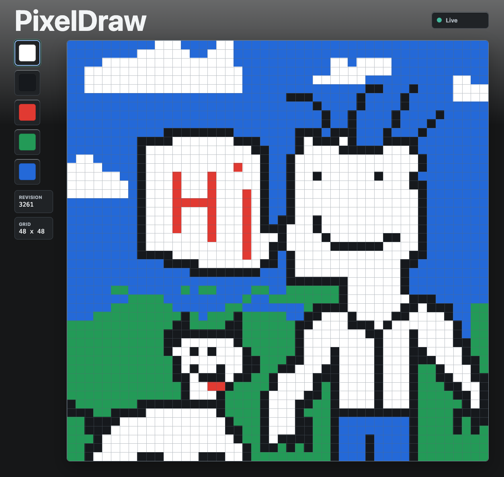

Pixeldraw
=========

* Requires Starlark, and websockets to be enabled. Recommend enabling memory sync in admin.
* Isn't super memory intensive, but given its pixels its heavy (one drawing is about 40kb of space)

