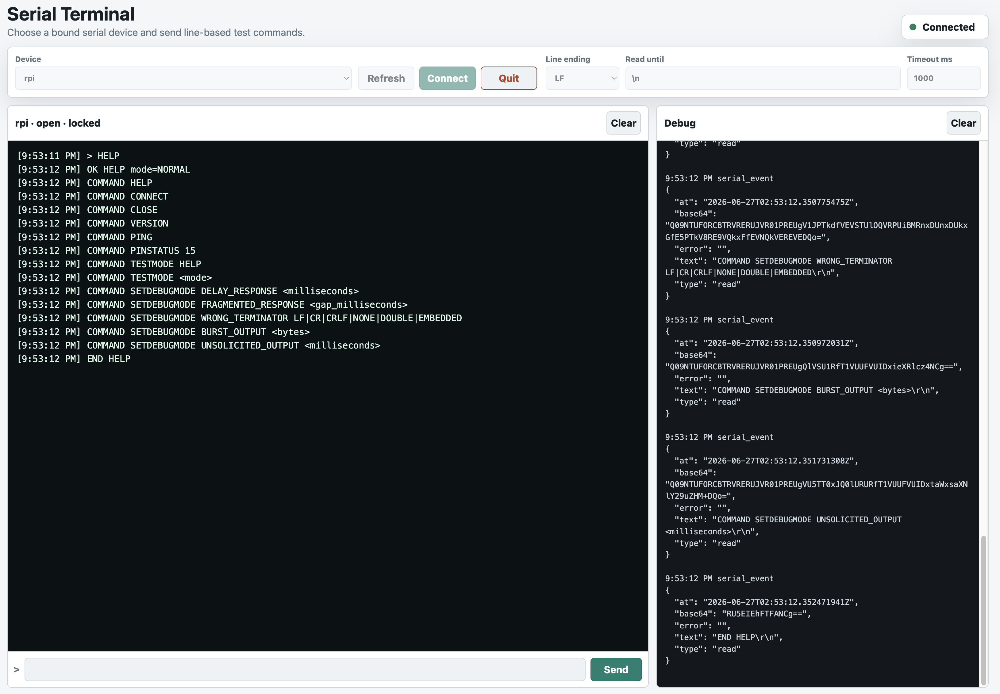

# Serial Terminal Pipes Demo

This demo exposes a small event-driven web terminal for serial devices bound to
the site. It discovers available aliases with `serial.list()`, opens one
explicitly, sends writes with `serial.write()`, and renders incoming serial bytes
from `hardware.serial.<alias>.read` events.

The site must have serial hardware configured through the admin hardware UI or
hardware config. Bound devices need both `serial_read` and `serial_write`
permissions for terminal use.
